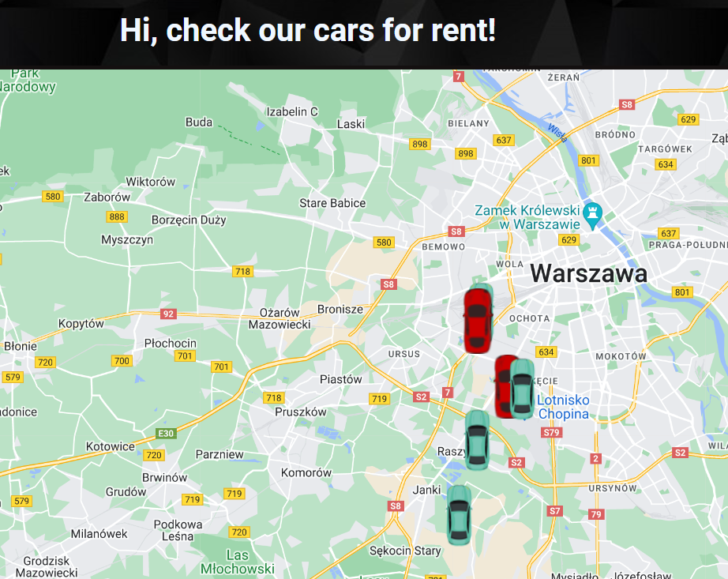
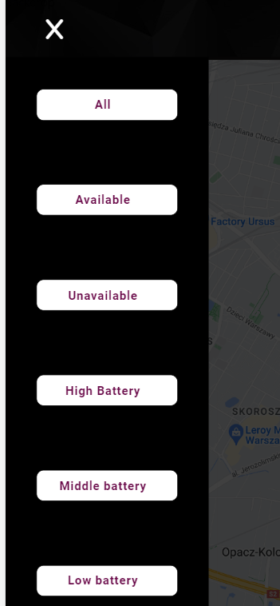
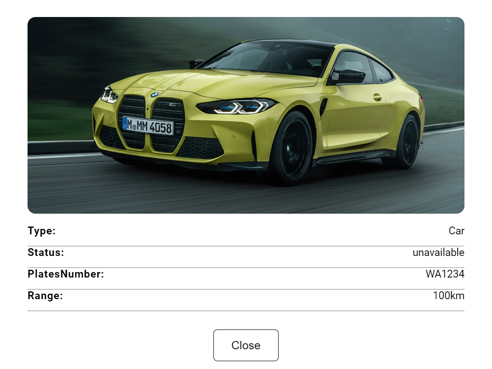

## Project Name & Pitch

Car GoogleMap

An application used to display cars from Firebase and also filter them based on user criteria, built with React,
Typescript, and CSS.

#### Live version: https://car-to-rent-info.netlify.app/

## Project Status

Project is in development. I want to add better error handling, loading states and also unit and functional tests.

## Project Screen Shots

Main view

Filters

Car details

## Installation and Setup Instructions

Clone down this repository. You will need `node` and `npm` installed globally on your machine.

Installation:

`npm install --legacy-peer-deps`

To Start Server:

`npm start`

To Visit App:

`localhost:3000/`

## Reflection

This project was built during the recruitment process for the position of junior react developer. Finally I work as
Angular developer but after some time I decided to refresh my React skills and make this app better mainly by adding
Typescript and refactoring existing code what will be done in the future.

When I was building the initial version of this project, the main goal was to create application which will get data
from external service by http requests and share them across whole application using React Context.

This project helped me to improve programming skills and also learn the core concepts of React: Components and
communication between them, React hooks, React Context and also get knowledge how to use Typescript in different
framework than Angular.